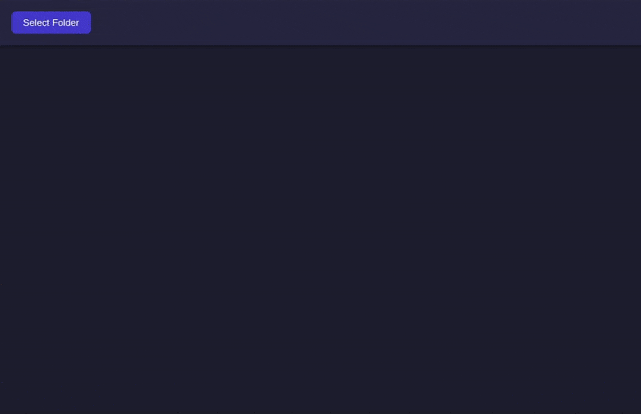

# Game Audio Manager Explorer

Game Audio Manager Explorer (GAME) is a software tool designed to help you efficiently manage your libraries of audio files, including both sound effects and music. It is specifically tailored to assist in finding the perfect tracks for games or any other project.

## Installation 🛠️

To run the program, follow these steps:

1. Clone the repository to your local machine
2. Navigate into the program directory
3. Open a terminal and run the following command to install the required dependencies:

    `npm install`

4. Still in the terminal, start the program by running:

    `npm run dev`

NOTE: you also need Node.js installed on your machine.

Unfortunately, I have not been able to create a working build at this time, so a click-and-run package is not available. For the details check the [related issue](https://github.com/stesproject/game-audio-manager-explorer/issues/1).

## Usage 🌟

Select a folder containing audio files (.mp3, .wav, .ogg, and .flac are supported).
This will go into children directories and show all audio track in a clean minimalistic table.

The field for each track are:

- **Title** Corresponding to file name.
- **Artist** Retrieved from metadata.
- **Album** Retrieved from metadata.
- **Length** Duration of the track measured in seconds.
- **Open Directory** button that opens the file location in your file manager.

To play a track you can either scroll through them using the `up/down arrow keys` or click on the track.
In both cases the track will starts playing automatically.

Press `Enter` to start/stop playing a track.

### Filtering

Tracks can be filtered by the following text bars:

- *Search Keyword* will semantically match the Title (file name), it is not case-sensitive and you do not need exact match.
- *Exclude keyword* will exclude all Titles including those words or sentences.
- *Max Length (sec)* allows you to filter tracks by duration of the track.

## What's Next 🔮

I would like to enhance the program with the following useful features:

- **Column-specific keyword filtering**: implement the ability to filter by keyword directly within each column, allowing users to filter by title, artist, or album. The filter by maximum length be at the top of the corresponding column.
- **Column sorting**: enable sorting of columns alphabetically and by track length.
- **Favorites tab**: introduce a feature to save files to a "Favorites" tab.
- **Project grouping**: allow users to group files into specific "projects" for streamlined management and easy export in the future.

## Contributing 🤝

Contributions are highly welcome!

While I am a web developer and use React and Vite in my daily work, this is my first project using Electron, and some aspects were quite challenging.

If you would like to enhance the program or add new features, your contributions would be greatly appreciated!

Please check the open issues for more details.
