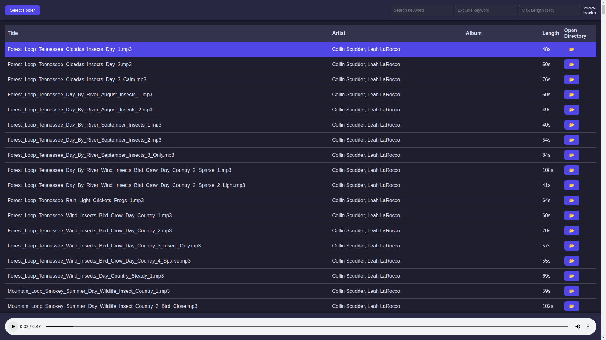

# Game Audio Manager Explorer

Game Audio Manager Explorer (GAME) is a software that allows you to manage your libraries of audio files, both sound and music.

Select a folder and go: the program will scan for audio files (.mp3, .wav, .ogg, and .flac are supported) in any subfolder of the selected directory and then show them in a minimalistic and clean table.

You'll see these metadata for each track:
- Title
- Artist
- Album
- Length

Click a track to start playing it, or scroll through them using the `arrow keys`. The selected track will start playing automatically.
Press `Enter` to start/stop playing a track.
Click on the `Open Directory` button to open the directory at the file path.

It is also possible to filter the tracks by:
- keyword
- excluded keyword
- max length

That's it.
This program is meant to help you find the right tracks for your game (or any project) if you have a huge library of music and sounds gathered over the years.

## How to Start

Unfortunately, I have not been able to create a working build, so you won't have a click-and-start program (if someone would like to help me with that, it would be very appreciated; see the Contributing section below).

To run the program:
- Clone the repository (you need `git` installed for that)
- Enter the program directory
- In a terminal, run: `npm i` to install the required dependencies
- Still in the terminal, run: `npm run dev` to start the program

## What's Next

At the moment, I have all the basic functionalities I need to easily explore my audio files when I need to find the perfect sound to fit a specific situation or a piece of music for a level from my huge library (thank you, Humble Bundle!).

Still, I would like to expand the program with these useful features:
- Filter by keyword directly in the column, so you can filter by keyword in the title, artist, or album. Automatically, the filter by max length will also go on top of the corresponding column.
- Sort columns alphabetically and/or by track length
- Save files to a "favorites" tab
- Group files into a "project" for easy export later

## Contributing

Contributions are very welcome.
Even if I'm a web developer and use React + Vite in my daily job, this is my first project using Electron, and some things ended up being quite tricky. I didn't expect that.

For example, I'm not able to properly load the index.html file for the production build, always getting different errors.
I also tried to move my code to a ready-to-use boilerplate and different templates, but then I have issues declaring a Worker in the Electron environment. A JS Worker is used to asynchronously load all the files from a folder with potentially a lot of files without making the app crash.

So if you would like to improve the program or add new functionalities, it would be really appreciated!